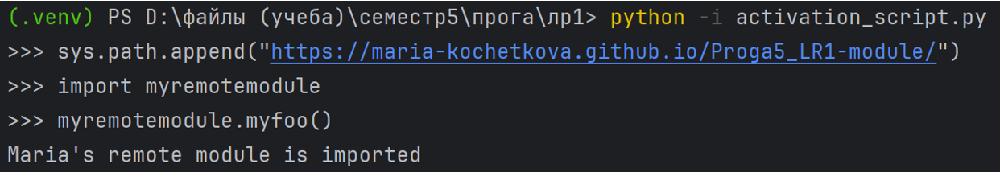

# Кочеткова Мария Павловна 3 курс ИВТ-2.2
## Лабораторная работа №1. Реализация удаленного импорта
### Шаг 1.
Создание файла myremotemodule.py, который будет испортироваться и размещение его в каталоге rootserver

### Шаг 2.
Размещение кода в файле

### Шаг 3.
Создание файла activation_script.py, который будет содержать функцию url_hook и классы URLLoader и URLFinder

### Шаг 4.
Запуск сервера

### Шаг 5.
Запуск файла activation_script.py

### Шаг 6.
Попытка импортировать модуль

### Шаг 7.
Добавление пути, где располагается модуль в sys.path

Выполнение импорта

### Шаг 8.
Выполнение удаленного импорта с помощью GitHub. Репозиторий с файлом модуля: https://github.com/Maria-Kochetkova/Proga5_LR1-module/ 

### Шаг 9.
Содержимое функции url_hook и класса URLLoader переписано с помощью модуля requests (старый код закомментирован) 
